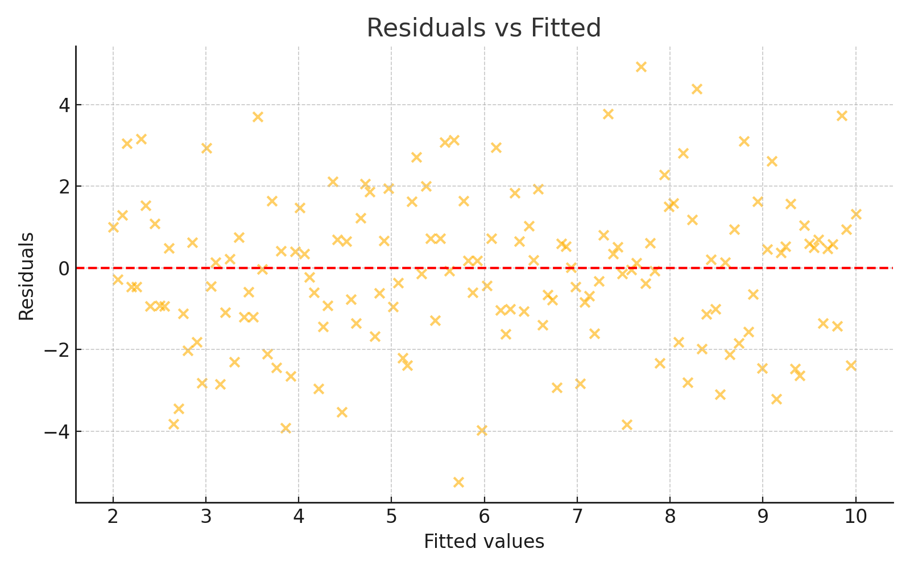
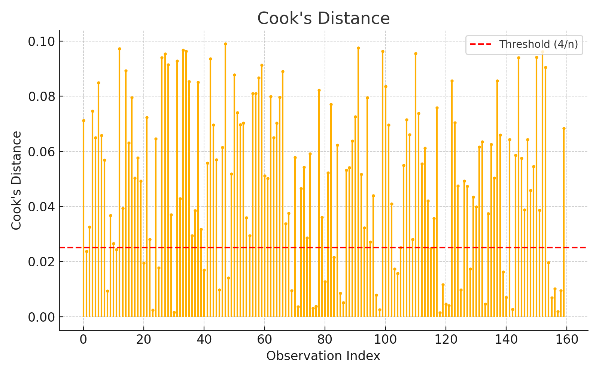
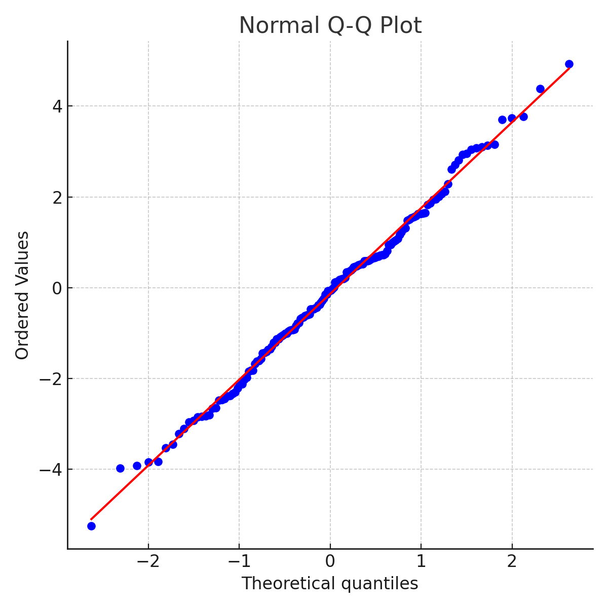

---
House Price Prediction (R)
---

<p align="center">
  
  <h2 align="center"><i>Get it done the BEDA way</i></h2>
</p>

---

### 🔗 Navigation  
[🏠 Home](./index.md) | [📈 R Project](https://kochezz.github.io/002-house-price-prediction-R/) | [📊 Python Project](https://kochezz.github.io/001-house-price-prediction-python/) | [📧 Contact](mailto:wphiri@beda.ie)

---

# 🏡 House Price Prediction using Multiple Linear Regression (R)

[](https://www.r-project.org/)
[](https://opensource.org/licenses/MIT)
[]()
[]()

---

## 📘 Project Overview

This project builds a **Multiple Linear Regression** model in **R** to predict the **selling price** of houses based on:

- Carpet area (in square feet)
- Distance from the nearest metro station (in km)
- Number of schools within 2 km

---

## 📂 Repository Structure

```
002-house-price-prediction-R/
├── data/
├── docs/
├── environment/
├── models/
├── R/
└── reports/
```

---

## 📊 Model Summary

- **R²:** 0.794
- **Adjusted R²:** 0.791
- **Train RMSE:** 1.699
- **Test RMSE:** 2.242

**All three predictors (`area`, `distance`, `schools`) were statistically significant.**

---

## 🔍 Diagnostics Summary

| Check                   | Result                         |
|------------------------|--------------------------------|
| Multicollinearity      | No (VIF < 5 for all variables) |
| Influential Points     | 19 removed (Cook’s Distance)   |
| Normality of Residuals | Slight deviation (p = 0.011)   |
| Homoscedasticity       | ✅ Verified via residual plots  |

---

### 📉 Model Diagnostics Plots

<p align="center">
  
  <br/>
  <em>Residuals vs Fitted</em>
</p>

<p align="center">
  
  <br/>
  <em>Cook's Distance</em>
</p>

<p align="center">
  
  <br/>
  <em>Normal Q-Q Plot</em>
</p>

---

## 📬 Contact

Business Enterprise Data Architecture (BEDA)  
📩 [wphiri@beda.ie](mailto:wphiri@beda.ie)  
🔗 [LinkedIn – William Phiri](https://www.linkedin.com/in/william-phiri-866b8443/)

---
